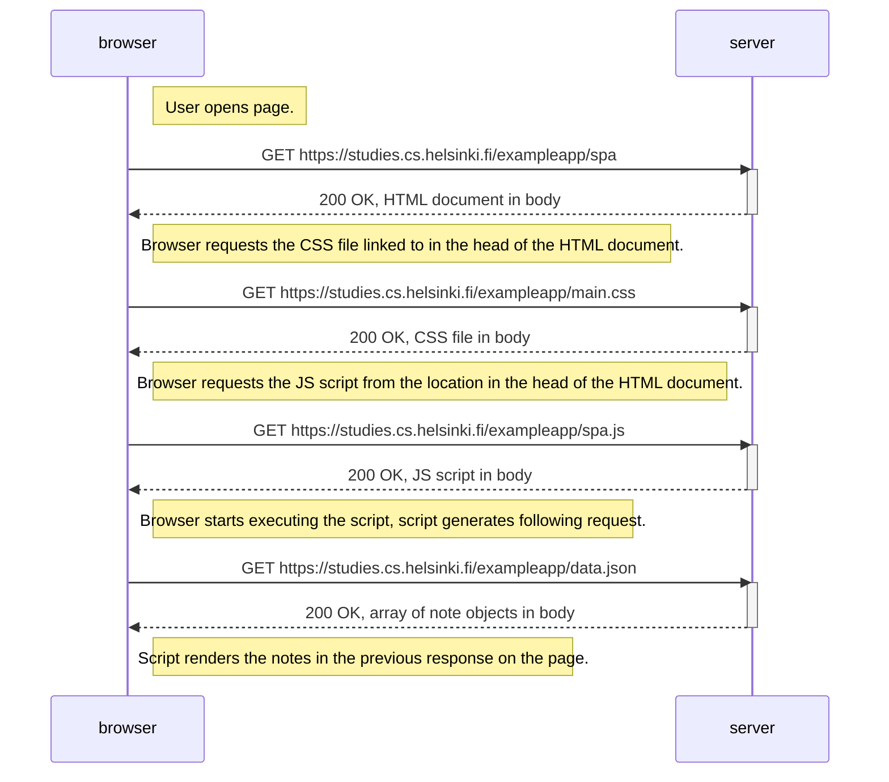

```mermaid
sequenceDiagram
    participant browser
    participant server

    Note right of browser: User opens page.

    browser->>server: GET https://studies.cs.helsinki.fi/exampleapp/spa
    activate server
    server-->>browser: 200 OK, HTML document in body
    deactivate server

    Note right of browser: Browser requests the CSS file linked to in the head of the HTML document.

    browser->>server: GET https://studies.cs.helsinki.fi/exampleapp/main.css
    activate server
    server-->>browser: 200 OK, CSS file in body
    deactivate server

    Note right of browser: Browser requests the JS script from the location in the head of the HTML document.

    browser->>server: GET https://studies.cs.helsinki.fi/exampleapp/spa.js
    activate server
    server-->>browser: 200 OK, JS script in body
    deactivate server

    Note right of browser: Browser starts executing the script, script generates following request.

    browser->>server: GET https://studies.cs.helsinki.fi/exampleapp/data.json
    activate server
    server-->>browser: 200 OK, array of note objects in body
    deactivate server

    Note right of browser: Script renders the notes in the previous response on the page.
```
