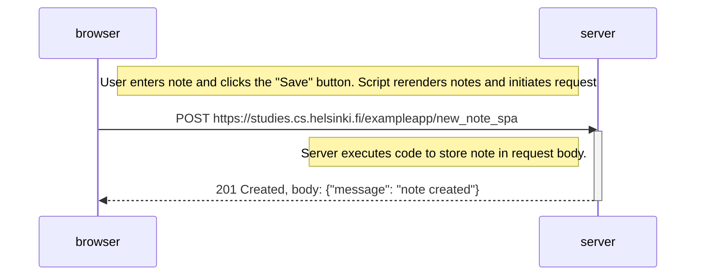

```mermaid
sequenceDiagram
    participant browser
    participant server

    Note right of browser: User enters note and clicks the "Save" button. Script rerenders notes and initiates request

    browser->>server: POST https://studies.cs.helsinki.fi/exampleapp/new_note_spa
    activate server
    Note left of server: Server executes code to store note in request body.
    server-->>browser: 201 Created, body: {"message": "note created"}
    deactivate server
```

Note: Server does not return new notes from other users in response.